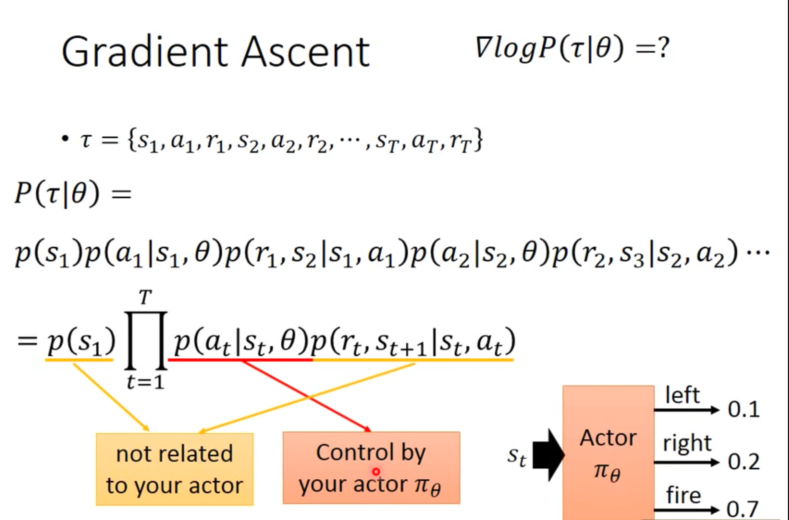
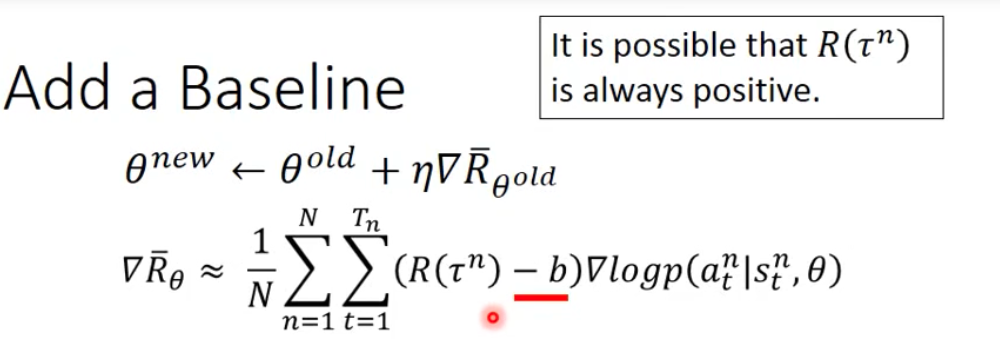

# LHY RL

Neural Network as Actor → DRL

Goodness of Actor

1. Generalization

Randomness in the actor and the game

expected value

Sample:

Gradient Ascent

#### b means baseline here.

Critic (Q-learning)

## Policy Gradient

Supervised learning

Yet Reward exists, so weighted by R($t^n$)

### On-policy -> Off-policy

Importance Sampling:
$$
E_{x～p}[f(x)] = E_{x～q}[f(x)\frac{p(x)}{q(x)}]
$$
