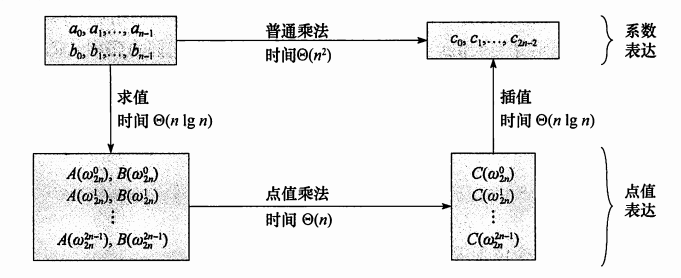

[toc]

# s.t. = subject to

### P-norm

$X = [x_1,x_2,...,x_n]$， 那么向量 $X$ 的 $L_p$ 范数定义如下:
$$
||x||_p = \sqrt[p] {\sum_{i}|x_i|^p}
$$
$L_0$

$L_1$

$L_2$

...

## Vector

scalar product = dot product

$a·b = a_1b_1+a_2b_2 + ...+a_nb_n$

out product

$a\times b =  |a|·|b|·sin<a,b>$

 

### Conjugate Transpose

can be motivated by nothing that complex numbers can be usefully representated by 2 $\times$ 2 real matrices, obeying matrix addition and multiplication.

#### Gradient & Divergence & Curl

- $\bigtriangledown$ 

- $\bigtriangledown .$

- $\bigtriangledown \times$

#### Possion's equation

- ##### Laplacian operator: The Div of Gradient $\bigtriangledown . \bigtriangledown$ \ $\bigtriangleup$ \ $\bigtriangledown^{2}$

Passion`s equation:
$$
\bigtriangledown^{2} \varphi = f
$$

### FFT(Fast Fourier Transform)

https://www.cnblogs.com/zwfymqz/p/8244902.html

点值表示法

欧拉公式

分治法

$O(n^2)$ - > $O(nlogn)$

回到系数表示法

### CG(Conjugate Gradient)

### preconditioning

### Nesterov Method

Momentum的改进

Momentum改进自SGD算法，让每一次的参数更新方向不仅仅取决于当前位置的梯度，还受到上一次参数更新方向的影响：

### Singular matrix & nonsingular matrix

如果A(n×n)为奇异矩阵（singular matrix）<=> A的秩Rank(A)<n.

如果A(n×n)为非奇异矩阵（nonsingular matrix）<=> A满秩，Rank(A)=n.

### Hessian matrix

在工程实际问题的优化设计中，所列的目标函数往往很复杂，为了使问题简化，常常将目标函数在某点邻域展开成泰勒多项式来逼近[原函数](https://baike.baidu.com/item/原函数)。

## 利用黑塞矩阵判定多元函数的极值

### 定理

设n多元实函数
$$
f(x_1,x_2,\dots,x_n)
$$
在点
$$
M_0(a_1,a_2,\dots,a_n)
$$
 的邻域内有二阶连续偏导，若有：
$$
\frac{\partial f}{\partial x_j}|_{(a_1,a_2,\dots,a_n)} = 0,j=1,2,\dots,n
$$

并且
$$
A=\begin{bmatrix}
\frac{\partial^2 f}{\partial x_1^2} & \frac{\partial^2 f}{\partial x_1\partial x_2} & \cdots  &\frac{\partial^2 f}{\partial x_1\partial x_n}
\\ \frac{\partial^2 f}{\partial x_2\partial x_1} & \frac{\partial^2 f}{\partial x_2^2}  & \cdots &\frac{\partial^2 f}{\partial x_2\partial x_n}
\\ \vdots &\vdots & \ddots & \vdots
\\ \frac{\partial^2 f}{\partial x_n \partial x_1} & \frac{\partial^2 f}{\partial x_n \partial x_2} & \cdots &\frac{\partial^2 f}{\partial x_n^2}
\end{bmatrix}
$$

则有如下结果：

（1）当A[正定矩阵](https://baike.baidu.com/item/正定矩阵)时，
$$
f(x_1,x_2,\cdots,x_n)
$$
 在
$$
M_0(a_1,a_2,\cdots,a_n)
$$

 处是极小值；

（2）当A[负定矩阵](https://baike.baidu.com/item/负定矩阵)时，
$$
f(x_1,x_2,\cdots,x_n)
$$
 在
$$
M_0(a_1,a_2,\cdots,a_n)
$$
 处是[极大值](https://baike.baidu.com/item/极大值)；

（3）当A[不定矩阵](https://baike.baidu.com/item/不定矩阵)时，
$$
M_0(a_1,a_2,\cdots,a_n)
$$

 不是极值点。

（4）当A为[半正定矩阵](https://baike.baidu.com/item/半正定矩阵)或半负定矩阵时，
$$
M_0(a_1,a_2,\cdots,a_n)
$$
 是“可疑”[极值点](https://baike.baidu.com/item/极值点)，尚需要利用其他方法来判定。 [3] 

### 实例

求三元函数
$$
f(x,y,z) = x^2+y^2+z^2+2x+4y-6z
$$
的极值。

解：因为
$$
\frac{\partial f}{\partial x} = 2x+2,\frac{\partial f}{\partial y} = 2y+4,\frac{\partial f}{\partial z}=2z-6
$$

，故该三元函数的驻点是
$$
(-1,-2,3)
$$

又因为
$$
\frac{\partial^2f}{\partial x^2} = 2,...
$$
故有：
$$
A= \begin{pmatrix}
2&0&0
\\0&2&0
\\0&0&2
\end{pmatrix}
$$

因为A是正定矩阵，故

$$
(-1,-2,3)
$$

是极小值点，且极小值
$$
f(-1,-2,3)=-14
$$

