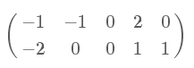
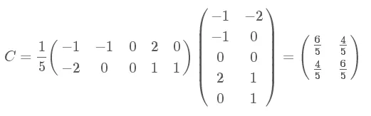
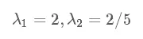
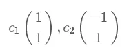
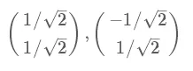
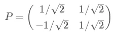
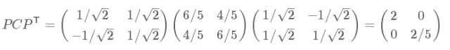
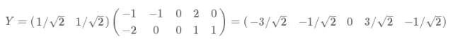
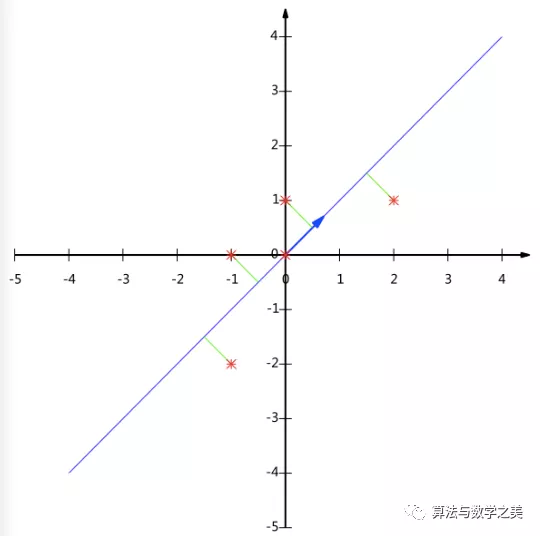

# PCA（Principla Component Analysis）

[link PCA](https://mp.weixin.qq.com/s/1KT-RQ1LR6dvYtFIvuNgdg)

## Abastract

PCA通过线性变换将原始数据变换为一组各维度线性无关的表示，可用于提取数据的主要特征分量，常用于高维数据的降维。

##  PCA算法流程

**PCA算法**

总结一下PCA的算法步骤：

设有m条n维数据。

1）将原始数据按列组成n行m列矩阵X

2）将X的每一行（代表一个属性字段）进行零均值化，即减去这一行的均值

3）求出协方差矩阵

4）求出协方差矩阵的特征值及对应的特征向量

5）将特征向量按对应特征值大小从上到下按行排列成矩阵，取前k行组成矩阵P

6）Y=PX即为降维到k维后的数据

## 实例

这里是上文提到的

为例，我们用PCA方法将这组二维数据其降到一维。

因为这个矩阵的每行已经是零均值，这里我们直接求协方差矩阵：

然后求其特征值和特征向量，具体求解方法不再详述，可以参考相关资料。求解后特征值为：

其对应的特征向量分别是：

其中对应的特征向量分别是一个通解，c1c1和c2c2可取任意实数。那么标准化后的特征向量为：

因此我们的矩阵P是：

可以验证协方差矩阵C的对角化：

最后我们用P的第一行乘以数据矩阵，就得到了降维后的表示：

降维投影结果如下图：

## 总结

根据上面对PCA的数学原理的解释，我们可以了解到一些PCA的能力和限制。PCA本质上是将方差最大的方向作为主要特征，并且在各个正交方向上将数据“离相关”，也就是让它们在不同正交方向上没有相关性。

因此，PCA也存在一些限制，例如它可以很好的解除线性相关，但是对于高阶相关性就没有办法了，对于存在高阶相关性的数据，可以考虑Kernel PCA，通过Kernel函数将非线性相关转为线性相关，关于这点就不展开讨论了。另外，PCA假设数据各主特征是分布在正交方向上，如果在非正交方向上存在几个方差较大的方向，PCA的效果就大打折扣了。

最后需要说明的是，PCA是一种无参数技术，也就是说面对同样的数据，如果不考虑清洗，谁来做结果都一样，没有主观参数的介入，所以PCA便于通用实现，但是本身无法个性化的优化。

希望这篇文章能帮助朋友们了解PCA的数学理论基础和实现原理，借此了解PCA的适用场景和限制，从而更好的使用这个算法。 

~2021/10/21~

