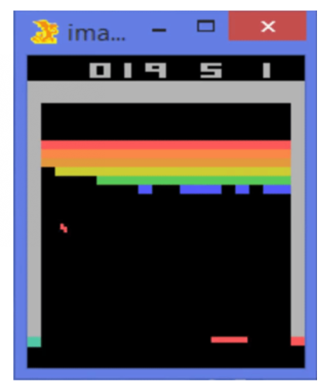
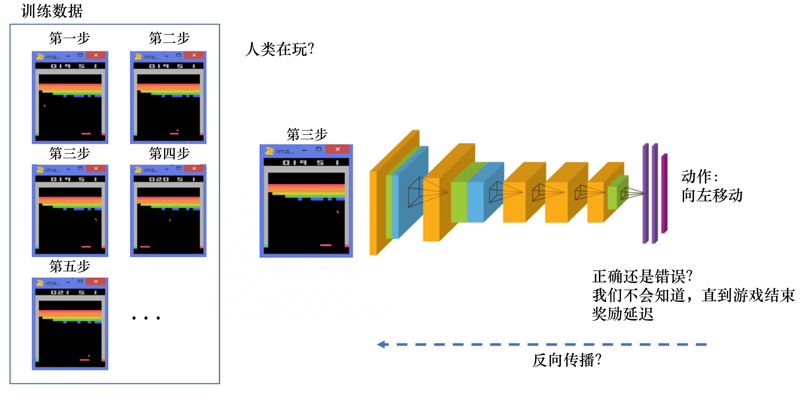
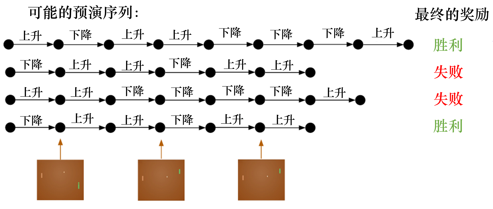
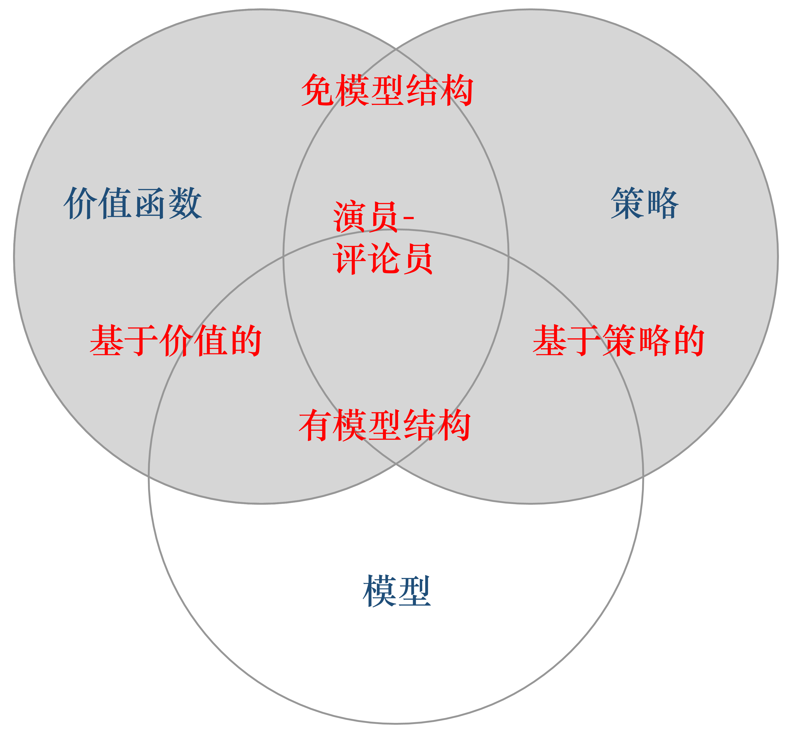

[toc]

# easyRL

## Part1

通常假设样本空间中全体样本服从一个未知分布，我们获得的每个样本都是独立地从这个分布上采样获得的，即独立同分(independent and identically distributed，简称 i.i.d.)。

在强化学习里面，这两点其实都不满足。举一个 Atari Breakout 游戏的例子，这是一个打砖块的游戏，控制木板左右移动把球反弹到上面来消除砖块。

- 在游戏过程中，大家可以发现这个 agent 得到的观测不是个独立同分布的分布，上一帧下一帧其实有非常强的连续性。这就是说，得到的数据是相关的时间序列数据，不满足独立同分布。
- 另外一点，在玩游戏的过程中，你并没有立刻获得反馈，没有告诉你哪个动作是正确动作。比如你现在把这个木板往右移，那么只会使得这个球往上或者往左上去一点，你并不会得到立刻的反馈。所以强化学习这么困难的原因是没有得到很好的反馈，然后你依然希望 agent 在这个环境里面学习。

强化学习的训练数据就是这样一个玩游戏的过程。你从第一步开始，采取一个决策，比如说你把这个往右移，接到这个球了。第二步你又做出决策，得到的训练数据是一个玩游戏的序列。

比如现在是在第三步，你把这个序列放进去，你希望这个网络可以输出一个决策，在当前的这个状态应该输出往右移或者往左移。这里有个问题：我们没有标签来说明你现在这个动作是正确还是错误，必须等到游戏结束才可能说明，这个游戏可能十秒过后才结束。现在这个动作到底对最后游戏结束能赢是否有帮助，其实是不清楚的。这里就面临`延迟奖励(Delayed Reward)`，所以就使得训练这个网络非常困难。

**我们对比下强化学习和监督学习。**

- 强化学习输入的是序列数据，而不是像监督学习里面这些样本都是独立的。
- 学习器并没有被告诉你每一步正确的行为应该是什么。学习器需要自己去发现哪些行为可以得到最多的奖励，只能通过不停地尝试来发现最有利的动作。
- Agent 获得自己能力的过程中，其实是通过不断地试错探索(trial-and-error exploration)。
  - 探索(exploration)和利用(exploitation)是强化学习里面非常核心的一个问题。
  - 探索：你会去尝试一些新的行为，这些新的行为有可能会使你得到更高的奖励，也有可能使你一无所有。
  - 利用：采取你已知的可以获得最大奖励的行为，你就重复执行这个动作就可以了，因为你已经知道可以获得一定的奖励。
  - 因此，我们需要在探索和利用之间取得一个权衡，这也是在监督学习里面没有的情况。
- 在强化学习过程中，没有非常强的监督者(supervisor)，只有一个`奖励信号(reward signal)`，并且这个奖励信号是延迟的，就是环境会在很久以后告诉你之前你采取的行为到底是不是有效的。Agent 在这个强化学习里面学习的话就非常困难，因为你没有得到即时反馈。当你采取一个行为过后，如果是监督学习，你就立刻可以获得一个指引，就说你现在做出了一个错误的决定，那么正确的决定应该是谁。而在强化学习里面，环境可能会告诉你这个行为是错误的，但是它并没有告诉你正确的行为是什么。而且更困难的是，它可能是在一两分钟过后告诉你错误，它再告诉你之前的行为到底行不行。所以这也是强化学习和监督学习不同的地方。

通过跟监督学习比较，我们可以总结出强化学习的一些特征。

- 强化学习有这个 `试错探索(trial-and-error exploration)`，它需要通过探索环境来获取对环境的理解。
- 强化学习 agent 会从环境里面获得延迟的奖励。
- 在强化学习的训练过程中，时间非常重要。因为你得到的数据都是有时间关联的(sequential data)，而不是独立同分布的。在机器学习中，如果观测数据有非常强的关联，其实会使得这个训练非常不稳定。这也是为什么在监督学习中，我们希望数据尽量是独立同分布，这样就可以消除数据之间的相关性。
- ==Agent 的行为会影响它随后得到的数据，这一点是非常重要的。在我们训练 agent 的过程中，很多时候我们也是通过正在学习的这个 agent 去跟环境交互来得到数据。所以如果在训练过程中，这个 agent 的模型很快死掉了，那会使得我们采集到的数据是非常糟糕的，这样整个训练过程就失败了。所以在强化学习里面一个非常重要的问题就是怎么让这个 agent 的行为一直稳定地提升。==

- 上图的过程是 `rollout` 的一个过程。Rollout 的意思是从当前帧去生成很多局的游戏。

- 当前的 agent 去跟环境交互，你就会得到一堆观测。你可以把每一个观测看成一个`轨迹(trajectory)`。轨迹就是当前帧以及它采取的策略，即状态和动作的一个序列：

  $$\tau=\left(s_{0}, a_{0}, s_{1}, a_{1}, \ldots\right)τ=(s0,a0,s1,a1,…)$$

- 最后结束过后，你会知道你到底有没有把这个球击到对方区域，对方没有接住，你是赢了还是输了。我们可以通过观测序列以及最终奖励(eventual reward)来训练这个 agent ，使它尽可能地采取可以获得这个最终奖励的动作。

- 一场游戏叫做一个 `episode(回合)` 或者 `trial(试验)`。

强化学习里面一个重要的课题就是近期奖励和远期奖励的一个权衡(trade-off)。怎么让 agent 取得更多的长期奖励是强化学习的问题。

当 agent 能够观察到环境的所有状态时，我们称这个环境是`完全可观测的(fully observed)`。在这种情况下面，强化学习通常被建模成一个 Markov decision process(MDP)的问题。在 MDP 中， $O_{t}=S_{t}^{e}=S_{t}^{a}$。

`部分可观测马尔可夫决策过程(Partially Observable Markov Decision Processes, POMDP)`是一个马尔可夫决策过程的泛化。POMDP 依然具有马尔可夫性质，但是假设智能体无法感知环境的状态 ss，只能知道部分观测值 oo。比如在自动驾驶中，智能体只能感知传感器采集的有限的环境信息。

POMDP 可以用一个 7 元组描述：$(S,A,T,R,\Omega,O,\gamma)$，其中 $S$ 表示状态空间，为隐变量，$A$ 为动作空间，$T(s'|s,a)$ 为状态转移概率，$R$ 为奖励函数，$\Omega(o|s,a)$为观测概率，$O$为观测空间

## [Types of RL Agents](https://datawhalechina.github.io/easy-rl/#/chapter1/chapter1?id=types-of-rl-agents)

**根据 agent 学习的东西不同，我们可以把 agent 进行归类。**

- ==基于价值==的 agent(value-based agent)
  - 这一类 agent 显式地学习的是价值函数，
  - 隐式地学习了它的策略。策略是从我们学到的价值函数里面推算出来的。
- ==基于策略==的 agent(policy-based agent)
  - 这一类 agent 直接去学习 policy，就是说你直接给它一个状态，它就会输出这个动作的概率。
  - 在基于策略的 agent 里面并没有去学习它的价值函数。
- 把 value-based 和 policy-based 结合起来就有了 `Actor-Critic agent`。这一类 agent 把它的策略函数和价值函数都学习了，然后通过两者的交互得到一个最佳的行为。

Q: 基于策略迭代和基于价值迭代的强化学习方法有什么区别?

A: 对于一个状态转移概率已知的马尔可夫决策过程，我们可以使用动态规划算法来求解；从决策方式来看，强化学习又可以划分为基于策略迭代的方法和基于价值迭代的方法。`决策方式`是智能体在给定状态下从动作集合中选择一个动作的依据，它是静态的，不随状态变化而变化。

在`基于策略迭代`的强化学习方法中，智能体会`制定一套动作策略`（确定在给定状态下需要采取何种动作），并根据这个策略进行操作。强化学习算法直接对策略进行优化，使制定的策略能够获得最大的奖励。

而在`基于价值迭代`的强化学习方法中，智能体不需要制定显式的策略，它`维护一个价值表格或价值函数`，并通过这个价值表格或价值函数来选取价值最大的动作。基于价值迭代的方法只能应用在不连续的、离散的环境下（如围棋或某些游戏领域），对于行为集合规模庞大、动作连续的场景（如机器人控制领域），其很难学习到较好的结果（此时基于策略迭代的方法能够根据设定的策略来选择连续的动作)。

基于价值迭代的强化学习算法有 Q-learning、 Sarsa 等，而基于策略迭代的强化学习算法有策略梯度算法等。此外， Actor-Critic 算法同时使用策略和价值评估来做出决策，其中，智能体会根据策略做出动作，而价值函数会对做出的动作给出价值，这样可以在原有的策略梯度算法的基础上加速学习过程，取得更好的效果。

Q: 有模型强化学习和免模型强化学习有什么区别？

A: 针对是否需要对真实环境建模，强化学习可以分为有模型学习和免模型学习。

- 有模型学习是指根据环境中的经验，构建一个虚拟世界，同时在真实环境和虚拟世界中学习；
- 免模型学习是指不对环境进行建模，直接与真实环境进行交互来学习到最优策略。

**目前，大部分深度强化学习方法都采用了免模型学习**，这是因为：

- 免模型学习更为简单直观且有丰富的开源资料，像 DQN、AlphaGo 系列等都采用免模型学习；
- 在目前的强化学习研究中，大部分情况下环境都是静态的、可描述的，智能体的状态是离散的、可观察的（如 Atari 游戏平台），这种相对简单确定的问题并不需要评估状态转移函数和奖励函数，直接采用免模型学习，使用大量的样本进行训练就能获得较好的效果。

### [K-armed Bandit](https://datawhalechina.github.io/easy-rl/#/chapter1/chapter1?id=k-armed-bandit)

实际上，单步强化学习任务对应了一个理论模型，即` K-臂赌博机(K-armed bandit)`。K-臂赌博机也被称为 `多臂赌博机(Multi-armed bandit) `。如上图所示，K-摇臂赌博机有 K 个摇臂，赌徒在投入一个硬币后可选择按下其中一个摇臂，每个摇臂以一定的概率吐出硬币，但这个概率赌徒并不知道。赌徒的目标是通过一定的策略最大化自己的奖赏，即获得最多的硬币。

- 若仅为获知每个摇臂的期望奖赏，则可采用`仅探索(exploration-only)法`：将所有的尝试机会平均分配给每个摇臂(即轮流按下每个摇臂)，最后以每个摇臂各自的平均吐币概率作为其奖赏期望的近似估计。
- 若仅为执行奖赏最大的动作，则可采用`仅利用(exploitation-only)法`：按下目前最优的(即到目前为止平均奖赏最大的)摇臂，若有多个摇臂同为最优，则从中随机选取一个。

显然，仅探索法能很好地估计每个摇臂的奖赏，却会失去很多选择最优摇臂的机会；仅利用法则相反，它没有很好地估计摇臂期望奖赏，很可能经常选不到最优摇臂。因此，这两种方法都难以使最终的累积奖赏最大化。

事实上，探索(即估计摇臂的优劣)和利用(即选择当前最优摇臂)这两者是矛盾的，因为尝试次数(即总投币数)有限，加强了一方则会自然削弱另一方，这就是强化学习所面临的`探索-利用窘境(Exploration-Exploitation dilemma)`。显然，想要累积奖赏最大，则必须在探索与利用之间达成较好的折中。

